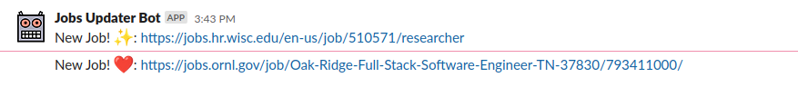

# Jobs Updater

The jobs updater is a simple GitHub action application to, given some trigger
and a yaml file with a list of jobs (or other links):

```
- name: My Job
  ...
  url: https://my-job.org/12345
```

The action will inspect the file to determine lines that are newly added (compared to the parent commit)
for a field of interest (e.g., the "url" attribute in a list of jobs), extract this field, and then post to a Slack channel.



This is custom made to help the [US-RSE](https://github.com/US-RSE/usrse.github.io) site
to have job updates posted to slack!

## Quickstart

1. Create a [webhook app](https://api.slack.com/messaging/webhooks#getting_started) and grab the URL and save to `SLACK_WEBHOOK` in your repository secrets.
2. Add a GitHub workflow file, as shown below, with your desired triggers.

For more details on the above, keep reading.

## 1. Slack Setup

You'll want to [follow the instructions here](https://api.slack.com/messaging/webhooks#getting_started) to create a webhook
for your slack community and channel of interest. This usually means first creating an application and selecting your slack
community.

1. For the kind of app, you'll want to select the first box for incoming webhooks.

You can then use the example to test the webhook with curl

```bash
curl -X POST -H 'Content-type: application/json' --data '{"text":"Hello, World!"}' YOUR_WEBHOOK_URL_HERE
```

Click on "Add new webhook to workspace" and then test the provided url with the bot. Copy the webhook URL
and put it in a safe place. We will want to keep this URL as a secret in our eventual GitHub workflow.


## 2. Usage

Add a GitHub workflow file in `.github/workflows` to specify the following. Note that
the workflow below will do the check and update on any push to main (e.g., a merged pull request).

### Deploy to Slack

```yaml
on:
  push:
    paths:
      - '_data/jobs.yml'
    branches:
      - main

jobs:
  slack-poster:
    runs-on: ubuntu-latest
    name: Run Jobs Slack Poster
    steps:
      - uses: actions/checkout@v2
        with:
          fetch-depth: 2

      - id: updater
        name: Job Updater
        uses: rseng/jobs-updater@main
        env:
          SLACK_WEBHOOK: ${{ secrets.SLACK_WEBHOOK }}
        with:
          filename: "_data/jobs.yml"
          keys: "url,name"
          unique: "url"

      - run: echo ${{ steps.updater.outputs.fields }}
        name: Show New Jobs
        shell: bash
```

In the above, we will include the url and name fields, and use the url field to determine uniqueness (default).
By default, given that you have the slack webhook in the environment, deployment will
happen because deploy is true. If you just want to test, then do:

```yaml
...
      - id: updater
        name: Job Updater
        uses: rseng/jobs-updater@main
        env:
          SLACK_WEBHOOK: ${{ secrets.SLACK_WEBHOOK }}
        with:
          filename: "_data/jobs.yml"
          keys: "url"
          deploy: false
```

If you want to run a test run (meaning a random number of jobs will be selected that
aren't necessarily new) then add test:

```yaml
...
      - id: updater
        name: Job Updater
        uses: rseng/jobs-updater@main
        env:
          SLACK_WEBHOOK: ${{ secrets.SLACK_WEBHOOK }}
        with:
          filename: "_data/jobs.yml"
          keys: "url"
          test: true
```

If test is true, deploy will always be set to false.

### Deploy to Twitter

To deploy to Twitter (in addiction to slack) you are required to set `deploy_twitter`
to true, and also define all the needed environment variables in your repository
secrets.

```yaml
      - id: updater
        name: Job Updater
        uses: rseng/jobs-updater@add/deploy-arg
        env:
          SLACK_WEBHOOK: ${{ secrets.SLACK_WEBHOOK }}
        with:
          filename: "_data/jobs.yml"
          keys: "url,name"

          deploy: true
          test: false

          # Also deploy to Twitter (all secrets required in repository secrets)
          twitter_deploy: true
          twitter_api_secret: ${{ secrets.TWITTER_ACCESS_SECRET }}
          twitter_api_key: ${{ secrets.TWITTER_ACCESS_TOKEN }}
          twitter_consumer_secret: ${{ secrets.TWITTER_CONSUMER_API_SECRET }}
          twitter_consumer_key: ${{ secrets.TWITTER_CONSUMER_API_KEY }}
```

### Deploy to Mastodon

To deploy to Mastodon you are required to set `deploy_mastodon`
to true, and also define all the needed environment variables in your repository
secrets.

```yaml
      - id: updater
        name: Job Updater
        uses: rseng/jobs-updater@main
        env:
          SLACK_WEBHOOK: ${{ secrets.SLACK_WEBHOOK }}
        with:
          filename: "_data/jobs.yml"
          key: "url"

          deploy: true
          test: false

          # Also deploy to Mastodon (all secrets required in repository secrets)
          # The access token can be generated by:
          # 1) visiting https://YOUR.MASTODON.SITE.HERE/settings/applications/new (after logging into it)
          # 2) choosing any name for the new application, only 'write:statuses' privileges are
          #    required for this purpose
          # 3) copying the value of 'Your access token' into a secret named MASTODON_ACCESS_TOKEN
          #    in the GitHub repository where you want to run the updater
          # 4) also add a secret named MASTODON_API_BASE_URL with the value of, e.g.,
          #    https://YOUR.MASTODON.SITE.HERE/
          mastodon_deploy: true
          mastodon_access_token: ${{ secrets.MASTODON_ACCESS_TOKEN }}
          mastodon_api_base_url: ${{ secrets.MASTODON_API_BASE_URL }}
```
